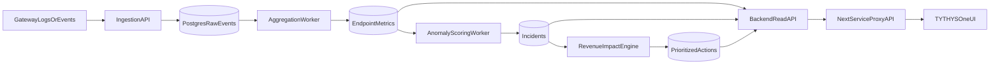

# API Revenue Guard V1 Plan

## Scope And Product Outcome
Build a focused v1 that answers three questions for API teams:
- What is breaking right now?
- What is the likely business impact?
- What should we fix first?

V1 includes ingestion, anomaly scoring, incident generation, impact estimation, API endpoints, and frontend dashboards aligned to current `front_end` architecture.

## Technical Direction (defaulted)
- Backend: Python + FastAPI in `C:/tythys-com/back_end`
- Data layer: Postgres-first (cheap, simpler ops), Redis for queue/cache
- Frontend: existing Next.js app in `C:/tythys-com/front_end`
- Deployment: optimize for Railway (low-friction, low cost). Keep config portable to Render.
- Initial ICP: fintech/SaaS API teams (shared needs around uptime + revenue sensitivity)

## Current Codebase Leverage
- Service registry already includes gateway service in [`C:/tythys-com/front_end/src/config/services.ts`](C:/tythys-com/front_end/src/config/services.ts)
- Frontend service summary proxy exists in [`C:/tythys-com/front_end/src/app/api/services/[serviceId]/route.ts`](C:/tythys-com/front_end/src/app/api/services/[serviceId]/route.ts)
- Mock/real backend switch exists in [`C:/tythys-com/front_end/src/lib/backend/registry.ts`](C:/tythys-com/front_end/src/lib/backend/registry.ts)
- Real summary fetch contract exists in [`C:/tythys-com/front_end/src/lib/backend/modules.ts`](C:/tythys-com/front_end/src/lib/backend/modules.ts)

## Architecture Blueprint

## Phase Plan

### Phase 1: Backend Foundation (Week 1)
- Create backend project structure in `C:/tythys-com/back_end`:
  - `app/main.py`, `app/core/config.py`, `app/api/routes/*`, `app/models/*`, `app/schemas/*`, `app/services/*`
  - `alembic/` for migrations
  - `docker-compose.yml` for local Postgres + Redis
- Add health, readiness, and version endpoints
- Introduce typed config via env vars and strict validation

### Phase 2: Telemetry Ingestion + Storage (Week 1-2)
- Add endpoint: `POST /v1/ingest/events` with API key auth
- Persist normalized event records (request id, route, status, latency, bytes, timestamp, tenant)
- Add idempotency key handling and basic rate limiting
- Create migration-backed schema for:
  - tenants, api_keys, raw_events, endpoint_rollups

### Phase 3: Detection + Incident Engine (Week 2-3)
- Build periodic workers:
  - rollups (1m/5m windows)
  - baseline and anomaly scoring (EWMA + z-score hybrid)
- Define incident lifecycle: open, acknowledged, resolved
- Add root-cause hints/rules (latency spike, error burst, endpoint concentration)

### Phase 4: Revenue Impact Layer (Week 3)
- Add per-tenant business config (value per successful request or per endpoint)
- Implement impact estimator (`estimatedLossPerHour`, `affectedTrafficPct`)
- Add prioritized action ranking by severity + impact + persistence

### Phase 5: Read APIs + Frontend Integration (Week 4)
- Backend read endpoints:
  - `GET /v1/incidents/current`
  - `GET /v1/endpoints/health`
  - `GET /v1/actions/prioritized`
  - `GET /v1/timeline`
- Extend Next proxy in [`C:/tythys-com/front_end/src/app/api/services/[serviceId]/route.ts`](C:/tythys-com/front_end/src/app/api/services/[serviceId]/route.ts) and `front_end` backend modules to consume these endpoints
- Add new dashboard sections/pages in frontend for:
  - Fix-first board
  - Incident timeline
  - Endpoint risk table

### Phase 6: Reliability, Security, And Beta Launch (Week 5-6)
- Add structured logs, tracing, and Sentry integration
- Add test suite:
  - backend unit + API tests
  - frontend integration smoke tests
- Harden auth and tenancy boundaries
- Prepare production runbooks and alerting

## Data Model (V1)
Core tables/entities:
- `tenants`
- `api_keys`
- `raw_events`
- `endpoint_rollups`
- `incident_records`
- `impact_snapshots`
- `action_queue`

## Environment And Deployment Plan
- Local: Docker Compose for Postgres + Redis, FastAPI via Uvicorn
- Staging/Prod:
  - Frontend on Vercel
  - Backend + Postgres + Redis on Railway
- Wire frontend env:
  - `BACKEND_MODE=real`
  - `BACKEND_BASE_URL=<railway-backend-url>`

## Acceptance Criteria For V1
- Ingest 1k+ events/min sustained on starter infra
- Detect latency/error anomalies within 60s windows
- Show actionable ranked incidents with business impact
- End-to-end path working from gateway event -> UI action card
- Contact lead capture remains operational for beta users

## Execution Order For Immediate Next Iteration
1. Backend skeleton + migrations + docker-compose
2. Ingestion API + API key auth
3. Rollup worker + anomaly scoring
4. Incident and impact endpoints
5. Frontend views and UX polish for actionability